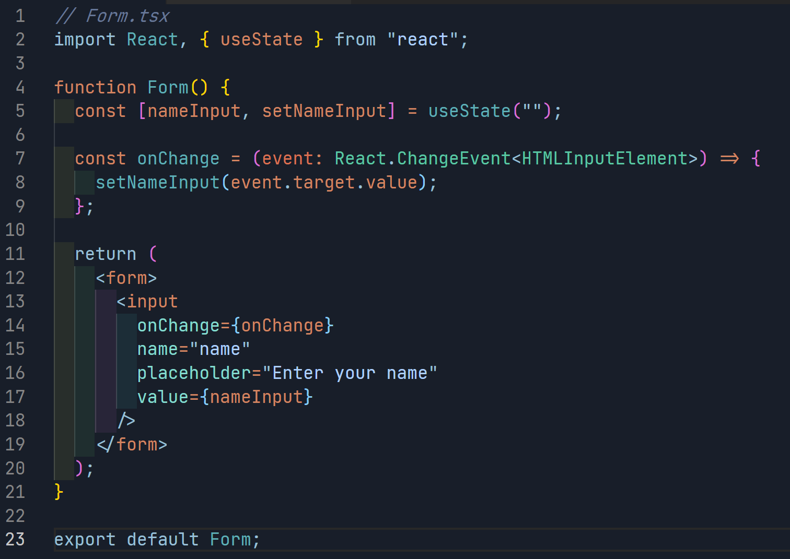
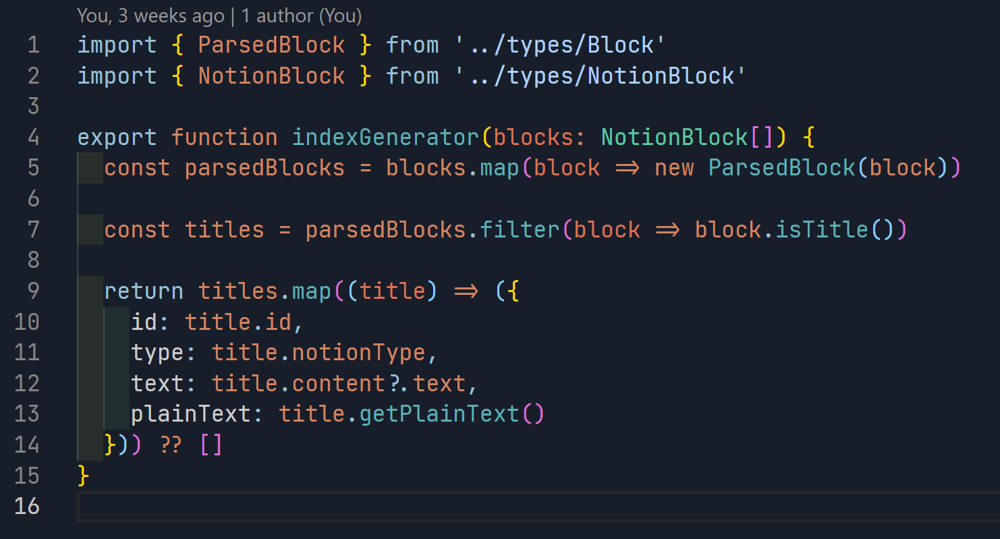
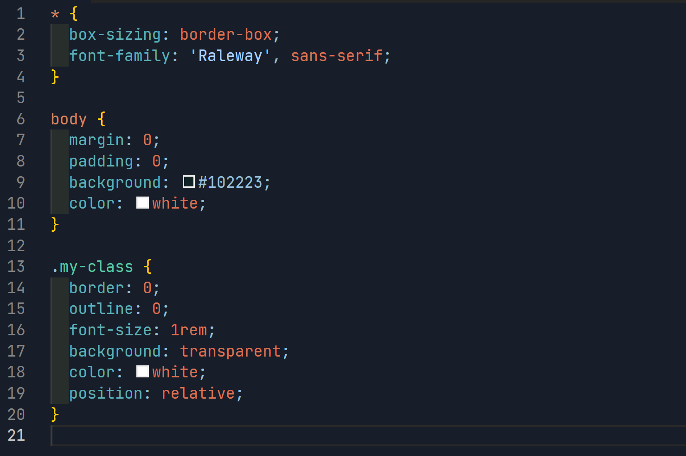
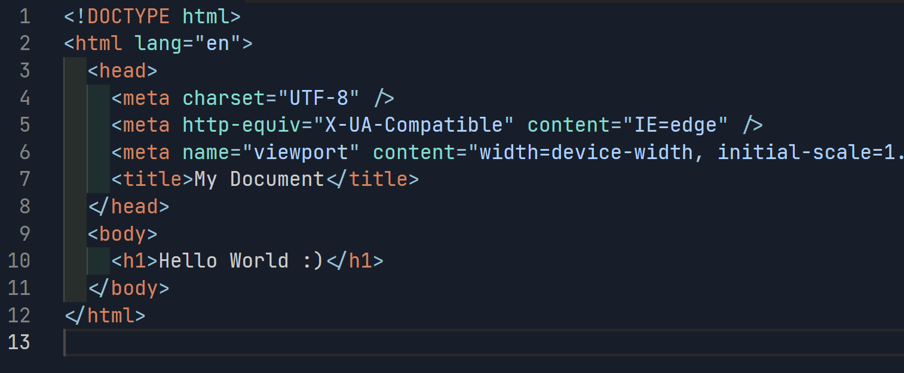

# Oreen
A theme to VSCode.

## Download
[VS Marketplace](https://marketplace.visualstudio.com/items?itemName=9gustin.oreen)

## How to dev?
Clone this repo and run in vscode(with the start button) :)

### Colors 
Background: #181e29
Comments: #677897
Main Orange: #d38561
Second Orange: #da7252
Lightblue: #99c0d8
Second Lightblue: #aed1ff
Main Green-blue: #5FB0B7
Second Green-blue: #5bc8a4
Between Lightblue and Green-blue: #84DCCF

### Screenshots

#### React (tsx)

#### Typescript

#### CSS

#### HTML

